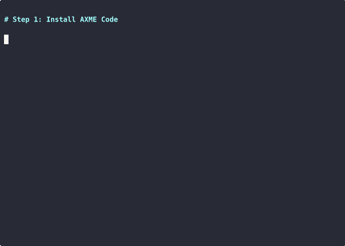
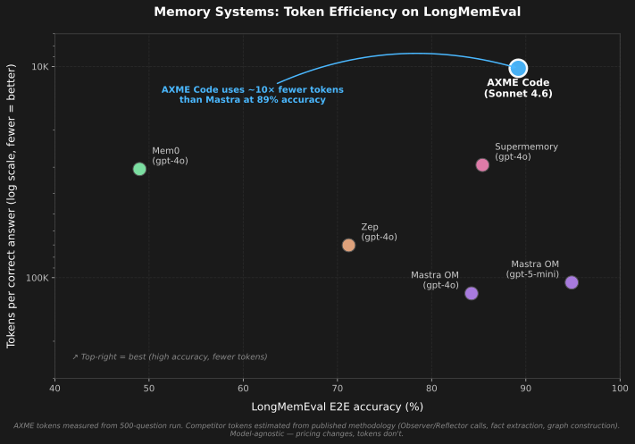
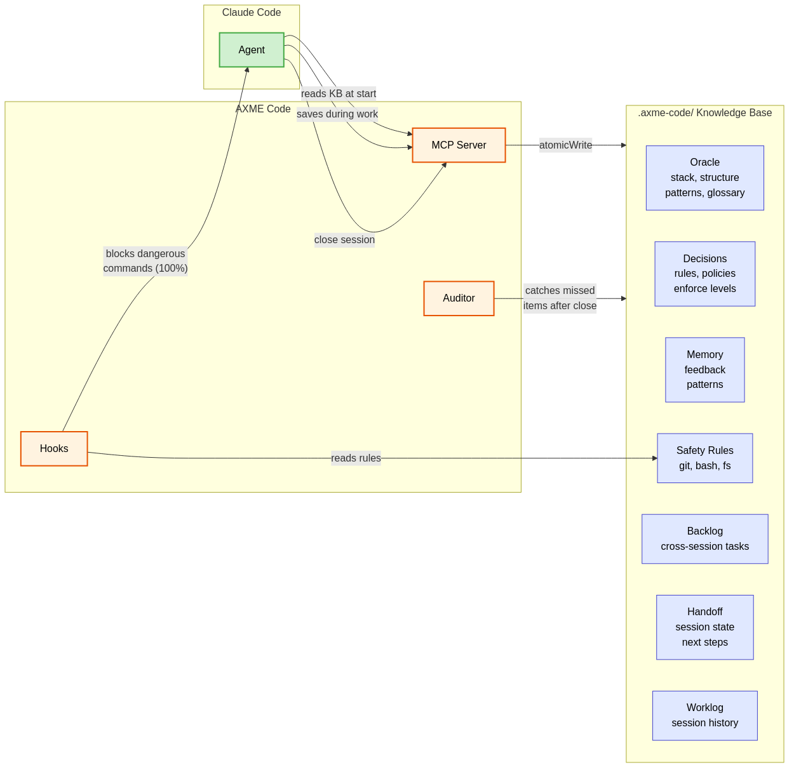

# AXME Code

### Claude Code forgets your project every session. We fixed it.

AXME Code is a [Claude Code](https://docs.anthropic.com/en/docs/claude-code) plugin that gives your AI coding agent **persistent memory across sessions**, **pre-execution safety hooks**, **architectural decision enforcement**, and **structured session handoff** — via an [MCP server](https://modelcontextprotocol.io/), automatically, across every session.

Stop re-explaining your architecture on session 47. Stop losing memory between session handoffs. Stop hoping the agent won't run `git push --force` to main. AXME Code remembers what happened, enforces your architectural decisions, continues where the last session stopped, and blocks dangerous commands before they execute — so you can focus on building.

You keep using Claude Code exactly as before. AXME Code works transparently in the background.

[]()
[](https://github.com/AxmeAI/axme-code/releases)
[](LICENSE)
[]()

> ⭐ **Star this repo** if it saves you time · 🔔 **Watch releases** for new features · 💬 [**Discussions**](https://github.com/AxmeAI/axme-code/discussions)

**[Quick Start](#quick-start)** · **[Before & After](#before--after)** · **[How It Works](#how-it-works)** · **[Architecture](docs/ARCHITECTURE.md)** · **[Website](https://code.axme.ai)**

---



## Before & After

<table>
<tr>
<th width="50%">Without AXME Code</th>
<th width="50%">With AXME Code</th>
</tr>
<tr>
<td>

**Session 1**: "We use FastAPI, not Flask. Deploy only via GitHub Actions. Never push to main directly."

**Session 2**: "Like I said yesterday, we use FastAPI..."

**Session 7**: "For the third time this week, we use FastAPI..."

**Session 47**: *gives up, mass-pastes 200 lines into CLAUDE.md*

</td>
<td>

**Session 1**: Agent learns your stack, saves decisions.

**Session 2**: Agent calls `axme_context` → already knows FastAPI, deploy rules, what happened yesterday.

**Session 47**: Agent has your full project history: 30 decisions, 15 memories, safety rules, and a handoff from session 46.

</td>
</tr>
<tr>
<td>

Agent runs `git push --force` to main. Your Friday is ruined.

</td>
<td>

Hook intercepts the command **before execution** and blocks it. Not a prompt — hard enforcement at the harness level.

</td>
</tr>
<tr>
<td>

Agent says "Done!" — but tests don't pass, half the code is stubbed, and the deploy is broken.

</td>
<td>

Decisions enforce verification requirements: agent must run tests and show proof before reporting completion.

</td>
</tr>
</table>

---

## Quick Start

**Requires [Claude Code](https://docs.anthropic.com/en/docs/claude-code) (CLI or VS Code extension).**

### Option 1: Claude Code plugin (recommended)

In Claude Code, run:

```
/plugin marketplace add anthropics/claude-plugins-community
/plugin install axme-code@claude-community
```

Or from the terminal:

```bash
claude plugin marketplace add anthropics/claude-plugins-community
claude plugin install axme-code@claude-community
```

The plugin ships with the MCP server, safety hooks, and CLI bundled together; no separate binary to install. On first use in a project, just ask the agent to call `axme_context` — the plugin auto-initializes the knowledge base on that session.

### Option 2: Standalone binary

Install the CLI system-wide (useful if you want to run `axme-code` outside Claude Code, e.g. for scripting).

**Linux / macOS:**
```bash
curl -fsSL https://raw.githubusercontent.com/AxmeAI/axme-code/main/install.sh | bash
```
Installs to `~/.local/bin/axme-code`. Supports x64 and ARM64.

**Windows (native):**
```powershell
irm https://raw.githubusercontent.com/AxmeAI/axme-code/main/install.ps1 | iex
```
Installs to `%LOCALAPPDATA%\Programs\axme-code` and adds it to your User PATH. Requires Node.js 20+ on PATH. Supports x64 and ARM64.

**Windows via WSL2:** if you already live in WSL2, use the Linux install one-liner inside your distro. Install Claude Code and axme-code **inside** the WSL distro, not on the Windows host.

Then in each project:

```bash
cd your-project          # or workspace root for multi-repo
axme-code setup
claude                   # that's it — use Claude Code as usual
```

`axme-code setup` does three things:
1. **Scans your project** and builds the knowledge base — oracle (stack, structure, patterns, glossary), extracts decisions, memories, and safety rules from your code, configs, CLAUDE.md, and session history
2. **Installs safety hooks** that intercept dangerous commands before execution
3. **Configures the MCP server** in Claude Code settings (`.mcp.json`)

After setup, every Claude Code session automatically loads the full knowledge base. No config, no manual steps.

---

## What You Get

### Persistent Knowledge Base
Your agent starts every session with full context: stack, decisions, patterns, glossary, and a handoff from the previous session. No more re-explaining your architecture on session 47.

| Category | What it stores | Example |
|----------|---------------|---------|
| **Oracle** | Project structure, tech stack, coding patterns, glossary | "TypeScript 5.9, Node 20, ESM, esbuild" |
| **Decisions** | Architectural decisions with enforcement levels | "All deploys via CI/CD only" [required] |
| **Memory** | Feedback from mistakes, validated patterns | "Never use sync HTTP in async handlers" |
| **Safety** | Protected branches, denied commands, filesystem restrictions | `git push --force` → BLOCKED |
| **Backlog** | Persistent cross-session task tracking | "B-003: migrate auth to OAuth2 [in-progress]" |
| **Handoff** | Where work stopped, blockers, next steps | "PR #17 open, waiting on review. Next: fix flaky test." |
| **Worklog** | Session history and events | Timeline of all sessions and what was done |

### Safety Guardrails (100% Reliable)
Hooks intercept tool calls **before execution** — not prompts. Even if the agent hallucinates a reason to run `rm -rf /`, the hook blocks it. This is hard enforcement at the Claude Code harness level, not a suggestion in a system prompt.

Blocked by default:
- `git push --force`, `git reset --hard`, direct push to `main`/`master`
- `rm -rf /`, `chmod 777`, `curl | sh`
- `npm publish`, `git tag`, `gh release create`
- Writing to `.env`, `.pem`, `.key` files

You can add your own custom rules via `axme_update_safety` or by editing `.axme-code/safety/rules.yaml` directly.

### Automatic Knowledge Extraction
The agent saves discoveries during work via MCP tools. At session close, a structured checklist ensures nothing is missed. If you just close the window — a background auditor extracts memories, decisions, and safety rules from the full session transcript.

### Multi-Repo Workspaces
Each repo gets its own knowledge base (`.axme-code/`). Workspace-level rules apply to all repos. Repo-specific rules stay scoped. The agent sees merged context — workspace safety floor + repo-specific decisions.

Supports 14 workspace formats: VS Code multi-root, pnpm/npm/yarn workspaces, Nx, Gradle, Maven, Rush, git submodules, and more.

### Why Not Just CLAUDE.md?

CLAUDE.md is great for simple projects with a few rules. But it doesn't scale:

| | CLAUDE.md | AXME Code |
|---|---|---|
| **Memory** | Static, manual | Automatic, accumulates across sessions |
| **Decisions** | Flat text, no enforcement | Structured, required/advisory levels |
| **Safety** | Prompt-based (~80% compliance) | Hook-based (100% enforcement) |
| **Session continuity** | None | Handoff + background auditor |
| **Scales to** | ~50 lines | Hundreds of decisions, memories, rules |

AXME Code complements CLAUDE.md — it reads your existing CLAUDE.md during setup and extracts decisions and rules from it.

---

## Works With Any MCP Client

AXME Code is a [stdio MCP server](https://modelcontextprotocol.io/) — every MCP-compatible AI coding assistant gets the full set of `axme_*` tools (knowledge base read/write, safety queries, status, worklog).

| Client | MCP Tools | Safety Hooks | Auto Auditor |
|---|---|---|---|
| **Claude Code** (CLI / VS Code) | ✅ Full | ✅ Full | ✅ Yes |
| **Cursor** | ✅ Full | ❌ | ❌ |
| **Windsurf** | ✅ Full | ❌ | ❌ |
| **Cline** (VS Code) | ✅ Full | ❌ | ❌ |
| **Claude Desktop** | ✅ Full | ❌ | ❌ |
| **Any other MCP client** | ✅ Full | ❌ | ❌ |

The MCP server entry is identical in every client:

```json
{
  "mcpServers": {
    "axme": {
      "command": "axme-code",
      "args": ["serve"]
    }
  }
}
```

Just place it in your client's MCP config file:
- **Cursor:** `~/.cursor/mcp.json` or `.cursor/mcp.json` (per-project)
- **Windsurf:** `~/.codeium/windsurf/mcp_config.json`
- **Cline:** VS Code Settings → Cline MCP → `cline_mcp_settings.json`
- **Claude Desktop:** `~/Library/Application Support/Claude/claude_desktop_config.json` (macOS) or equivalent

Pre-execution safety hooks, the post-tool-use file tracker, and the background session auditor are Claude Code-specific (they require Claude Code's hook system). In other clients, the agent must call AXME tools explicitly — same knowledge base, same `.axme-code/` storage, just no automatic enforcement layer.

See [docs/MULTI_CLIENT.md](docs/MULTI_CLIENT.md) for full per-client setup, hook workarounds, and concurrent-client semantics.

---

## Comparison

| | AXME Code | MemPalace | Mastra | Zep | Mem0 | Supermemory |
|---|---|---|---|---|---|---|
| **Capabilities** | | | | | | |
| Structured decisions w/ enforce levels | ✅ | ❌ | ❌ | ❌ | ❌ | ❌ |
| Pre-execution safety hooks | ✅ | ❌ | ⚠️ | ❌ | ❌ | ❌ |
| Structured session handoff | ✅ | ❌ | ❌ | ❌ | ⚠️ | ❌ |
| Automatic knowledge extraction | ✅ | ❌ | ✅ | ✅ | ✅ | ✅ |
| Project oracle (codebase map) | ✅ | ❌ | ❌ | ❌ | ❌ | ❌ |
| Multi-repo workspace | ✅ | ❌ | ❌ | ❌ | ❌ | ❌ |
| Local-only storage | ✅ | ✅ | ✅ | ❌ | ❌ | ❌ |
| Semantic memory search | ✅ | ✅ | ✅ | ✅ | ✅ | ✅ |
| Multi-client support | ✅ | ✅ | ✅ | ✅ | ✅ | ✅ |
| **Capabilities total** | **9/9** | 3/9 | 4/9 | 3/9 | 3/9 | 3/9 |
| **Benchmarks** | | | | | | |
| ToolEmu safety (accuracy) | **100.00%** | — | — | — | — | — |
| ToolEmu safety (FPR) | **0.00%** | — | — | — | — | — |
| LongMemEval E2E | **89.20%** | — | 84.23% / 94.87% | 71.20% | 49.00% | 85.40% |
| LongMemEval R@5 | **97.80%** | 96.60% | — | — | — | — |
| LongMemEval tokens/correct | **~10K** ✓ | — | ~105K–119K | ~70K | ~31K | ~29K |

### Token efficiency



AXME uses **~10× fewer tokens per correct answer** than Mastra at competitive accuracy. The memory system runs only 2 LLM calls per question (reader + judge) — competitors run dozens (Observer per turn, Reflector periodically, graph construction, fact extraction).

See [benchmarks/README.md](benchmarks/README.md) for full methodology, per-category breakdowns, footnotes, and reproduction instructions.

---

## How It Works



### Session Flow

1. **Session starts** → agent calls `axme_context`, loads full knowledge base
2. **During work** → agent saves discoveries via `axme_save_memory`, `axme_save_decision`. Hooks enforce safety on every tool call.
3. **Session close** → ask your agent to close the session → agent calls `axme_begin_close`, gets a checklist. Reviews the session for missed memories, decisions, safety rules. Calls `axme_finalize_close` — MCP writes handoff, worklog, and extractions atomically.
4. **Fallback** → if you just close the window, the background auditor extracts everything from the transcript.
5. **Next session** → `axme_context` returns everything accumulated. Handoff says exactly where to continue.

> **Tip**: You can save at any time — just tell the agent "remember this" or "save this as a decision". You don't have to wait for session close.

---

## Storage

All data lives in `.axme-code/` in your project root (gitignored automatically):

```
.axme-code/
  oracle/           # stack.md, structure.md, patterns.md, glossary.md
  decisions/        # D-001-slug.md ... D-NNN-slug.md (with enforce levels)
  memory/
    feedback/       # Learned mistakes and corrections
    patterns/       # Validated successful approaches
  safety/
    rules.yaml      # git + bash + filesystem guardrails
  backlog/          # B-001-slug.md ... persistent cross-session tasks
  sessions/         # Per-session meta.json (tracking, agentClosed flag)
  plans/
    handoff-<id>.md # Per-session handoff (last 5 kept)
  worklog.jsonl     # Structured event log
  worklog.md        # Narrative session summaries
  config.yaml       # Model settings, presets
```

Human-readable markdown and YAML. No database, no external dependencies.

---

## AXME Platform

AXME Code is the developer tools layer of the [AXME platform](https://github.com/AxmeAI) — durable execution infrastructure for AI agents.

---

<details>
<summary><strong>Components</strong></summary>

AXME Code has three components:

### 1. MCP Server (persistent, runs while VS Code is open)

Provides tools for the agent to read and write the knowledge base. All writes go through MCP server code (atomicWrite, correct append) — the agent never writes storage files directly.

### 2. Hooks (fire on every tool call)

**pre-tool-use**: Checks every Bash command, git operation, and file access against safety rules. Blocks violations before execution. Also creates/recovers session tracking.

**post-tool-use**: Records which files the agent changed (for audit trail).

### 3. Background Auditor (runs after session close)

A detached process that reads the session transcript and catches anything the agent forgot to save. Two modes:
- **Full extraction** — when the agent crashed or user closed without formal close
- **Verify-only** — when the agent completed the close checklist (lighter, cheaper)

</details>

<details>
<summary><strong>Available MCP Tools (19 tools)</strong></summary>

| Tool | Description |
|------|-------------|
| `axme_context` | Load full knowledge base (oracle + decisions + safety + memory + handoff) |
| `axme_oracle` | Show oracle data (stack, structure, patterns, glossary) |
| `axme_decisions` | List active decisions with enforce levels |
| `axme_memories` | Show all memories (feedback + patterns) |
| `axme_save_decision` | Save a new architectural decision |
| `axme_save_memory` | Save feedback or pattern memory |
| `axme_safety` | Show current safety rules |
| `axme_update_safety` | Add a new safety rule |
| `axme_backlog` | List or read backlog items |
| `axme_backlog_add` | Add a new backlog item |
| `axme_backlog_update` | Update backlog item status, priority, or notes |
| `axme_status` | Project status (sessions, decisions count, last activity) |
| `axme_worklog` | Recent worklog events |
| `axme_workspace` | List all repos in workspace |
| `axme_begin_close` | Start session close — returns extraction checklist |
| `axme_finalize_close` | Finalize close — writes handoff, worklog, extractions atomically |
| `axme_ask_question` | Record a question for the user |
| `axme_list_open_questions` | List open questions from previous sessions |
| `axme_answer_question` | Record the user's answer |

</details>

<details>
<summary><strong>CLI Commands</strong></summary>

```bash
axme-code setup [path]       # Initialize project/workspace with LLM scan
axme-code serve              # Start MCP server (called by Claude Code automatically)
axme-code status [path]      # Show project status
axme-code stats [path]       # Worklog statistics (sessions, costs, safety blocks)
axme-code audit-kb [path]    # KB audit: dedup, conflicts, compaction
axme-code hook pre-tool-use  # PreToolUse hook handler (called by Claude Code)
axme-code hook post-tool-use # PostToolUse hook handler
axme-code hook session-end   # SessionEnd hook handler
axme-code audit-session      # Run LLM audit on a session transcript
```

</details>

<details>
<summary><strong>Preset Bundles</strong></summary>

During `axme-code setup`, preset bundles provide curated best-practice rules:

| Preset | What it adds |
|--------|-------------|
| **essential-safety** | Protected branches, no secrets in git, no force push, fail loudly |
| **ai-agent-guardrails** | Verification requirements, no autonomous deploys, proof before done |

Additional presets available: `production-ready`, `team-collaboration`.

</details>

---

<details>
<summary><strong>Telemetry</strong></summary>

axme-code sends anonymous usage telemetry to help us improve the product. We collect:

- **Lifecycle events**: install, startup, version update
- **Product health events**: setup completion, audit completion (counts of memories/decisions/safety extracted, duration, cost, error class)
- **Errors**: category and bounded error class for failures in audit, setup, hooks, and auto-update

What we **never** send:
- Hostnames, usernames, file paths, working directories
- Source code, transcripts, decisions, memories, or any project content
- IP addresses (stripped at the server)
- Raw exception messages (we map to a small set of error classes)

Each install gets a random 64-character machine ID stored in `~/.local/share/axme-code/machine-id`. The ID is not derived from hardware and cannot be linked back to you.

**To disable telemetry**, set either of these environment variables:

```bash
export AXME_TELEMETRY_DISABLED=1
# or the industry-standard:
export DO_NOT_TRACK=1
```

When disabled, no network requests are made and no machine ID is generated.

</details>

---

## Contributing

See [CONTRIBUTING.md](CONTRIBUTING.md) for guidelines.

## License

[MIT](LICENSE)

---

[Website](https://code.axme.ai) · [Issues](https://github.com/AxmeAI/axme-code/issues) · [Architecture](docs/ARCHITECTURE.md) · contact@axme.ai
